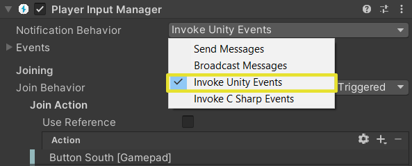
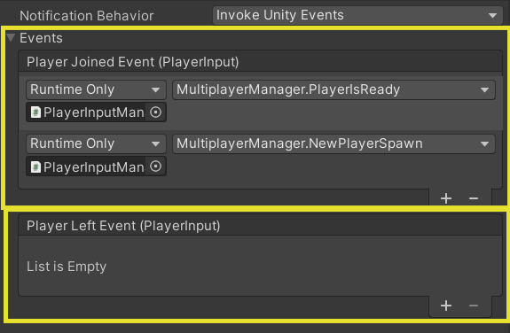
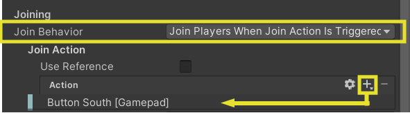
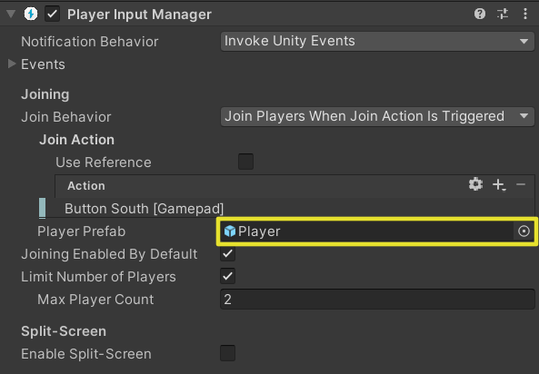
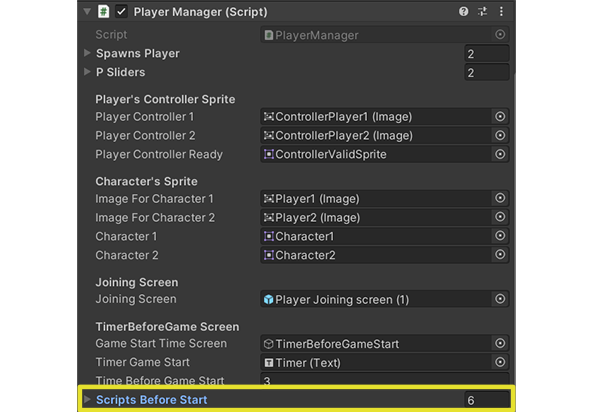
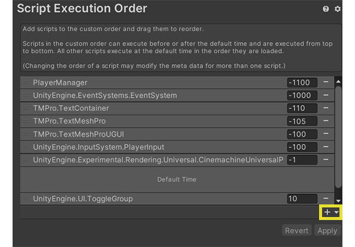
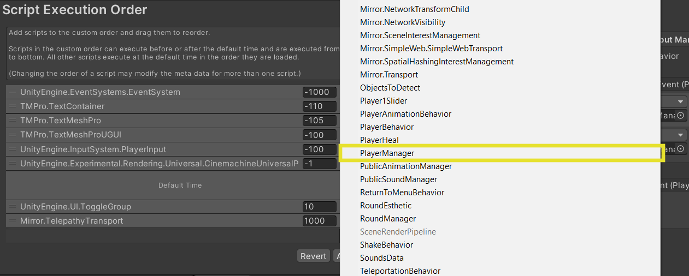
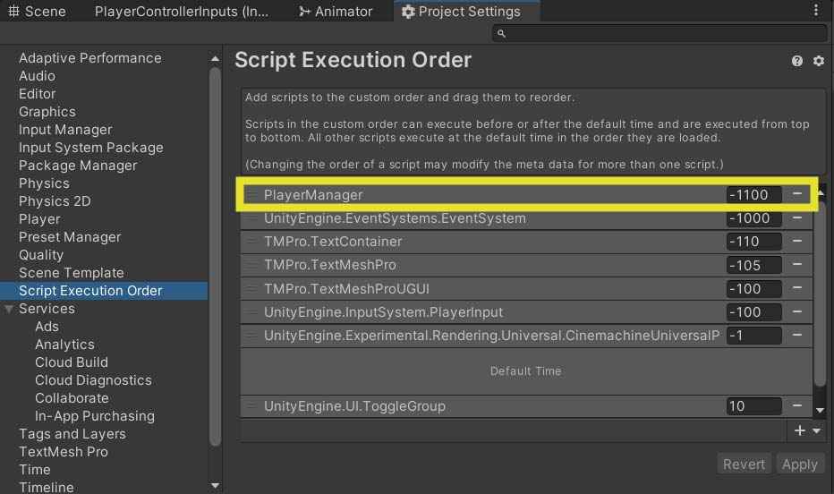
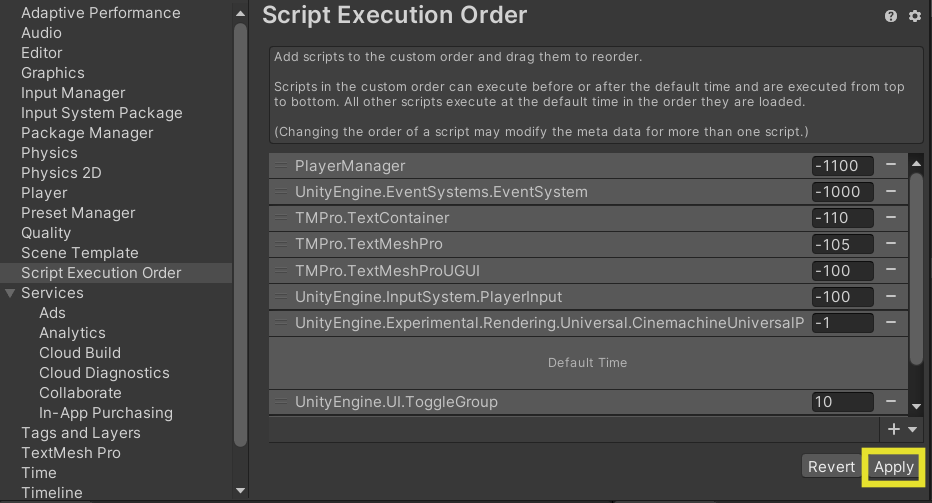
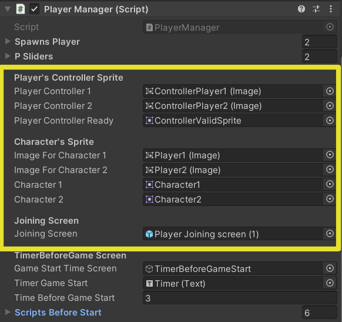

# Player Manager

## *Requirements*
- Input System asset
- PlayerInputManager components in script's object.
- Player input component in a player prefab

---

## ***Role***
This script is there to create a local multiplayer in the game.

Its use is based on the PlayerInputManager.

The current script system uses the playerCount that joined the game.

Until all players join the game, most of the game’s scripts will remain disabled and the game will not start.

---

## ***Operation***

### **1. PlayerInputManager**
Here, the PlayerInputManager component is the central unit of the system:
1. It manages the entry and exit of players in the game. And it has a player counter which will allow to check the number of players in the  game and to define the order of the players,
3. It instantiates a character prefab when a player join.

#### **1.1 Entry/Exit of players & Numbers players**
Players' entries and exits are based on __Unity Events__.

When a player will join, an event will be called -> __Player Joined Event__.

This event is called when you activate a specific input that is specified on the component.

In our system, this event will call 2 methods:
- *PlayerIsReady* -> will diplay in game that the player who has just joined is ready
- *GetPlayerInstance* -> Places the prefab instance in the scene

#### **1.2 Instiante a prefab Player**
In the PlayerInputManager, we refer to a prefab "Player" which will be instantized each time a player joins the game.

### **2. Script disabled phase linked to the player’s prefab**

Before any player can join the game, all scripts that are linked to the player’s prefab are disabled (ex : PlayerController/ LifeManager/ ScoreManager/ etc).

This is actually delaying the start of the game until all the players have joined.

**!! Warning !!**
This script must be executed before all others to make sure there are no errors.
For this, it is best to put the script first in the Script Execution order.

*! This method is ephemeral because it is not optimized. !*

### **3. Joining screen & Timer before game starts**
This screen shows all players who are ready to play.
It is supposed to contain/activate all feedback showing that a player has joined the game.

Once everyone has joined, the screen disappears and a timer of a few seconds appears so that players feel ready to play when the timer is at 0 seconds.

### **4. Script enabled phase**
When the timer is finished, all previously deactivated scripts reactivate.
The game starts then.
---

